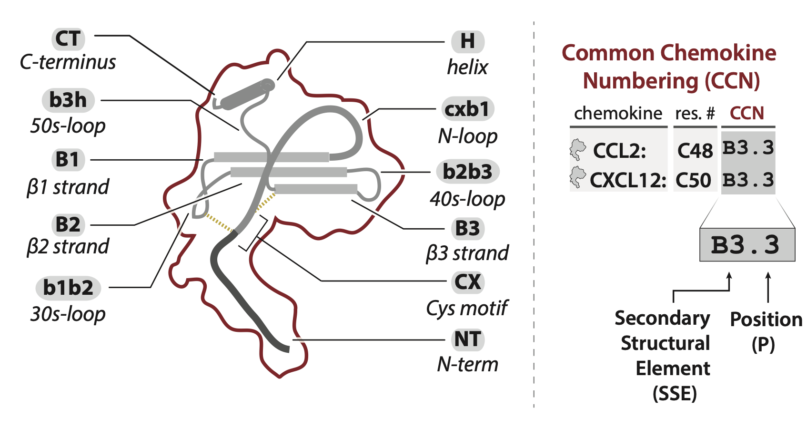

## **common chemokine numbering (CCN)**

```{r, out.width='60%', fig.align='center', message=FALSE, echo=FALSE}

```

<br>

#### Each secondary structural element (SSE) of the chemokine is given a designation (e.g., CX for Cys motif, B1 for B1-strand, etc), and each residue within an SSE is given an index (e.g., B1.1 is the first residue within the B1-strand. This system allows comparison of structurally equivalent positions across different chemokines. For instance, position B3.3 corresponds to C48 in CCL2 and C50 in CXCL12 due to differences in the length of their respective N-termini. 

<br>

```{r, echo=FALSE, message=FALSE, warning=FALSE}
source("code/000_libraries.R")
data <- read_csv("data/sequence/chemokine/alignment_csv/ALL_para_df.csv") %>%
  dplyr::select(-seq, -class) %>% mutate(protein = toupper(protein))

```


```{r, echo=FALSE, message=FALSE, warning=FALSE}

# reactable(data, filterable = TRUE, defaultPageSize = 46,
#           columns = list(
#             protein = colDef(style = list(position = "sticky",left = 0,
#                                           background ="#fff", zIndex = 1))
#   ))

# Below is attempt to color by residue type; works but needs to be expanded to make rule that applies to full table instead of individual column callouts
# reactable(data, filterable = TRUE, defaultPageSize = 46,
#           columns = list(
#             protein = colDef(style = list(position = "sticky",left = 0,
#                                           background ="#fff", zIndex = 1)),
# 
#             NTc.Cm1 = colDef(
#               style = function(value){
#                 color <- case_when(
#                   value %in% c("R","K","H") ~ "lightblue",
#                   value %in% c("D","E") ~ "red",
#                   value %in% c("N","Q","S","T") ~ "lightgreen",
#                   value %in% c("G","P") ~ "purple",
#                   value %in% c("C") ~ "yellow",
#                   value %in% c("F","W","Y") ~ "gold",
#                   value %in% c("A","I","L","M","V") ~ "pink")
# 
#                 list(background = color)
#                 })
# 
#   ))


# (1) COLOR ASSIGNMENT
# function that assigns colors to AAs
ResidueZappo <-  function(value){
  color <- case_when(
    value %in% c("R","K","H") ~ "lightblue",
    value %in% c("D","E") ~ "red",
    value %in% c("N","Q","S","T") ~ "lightgreen",
    value %in% c("G","P") ~ "mediumslateblue",
    value %in% c("C") ~ "yellow",
    value %in% c("F","W","Y") ~ "gold",
    value %in% c("A","I","L","M","V") ~ "pink")
}

# function that assigns above function to "background" variable
stylefunc <- function(value) {
  color <- ResidueZappo(value)
  list(background = color)
}

# list giving column formatting (using style function)
coldefs <- list(
  reactable::colDef(style = stylefunc)
)
# get names of cols to format
numcols <- data %>% dplyr::select(2:ncol(data)) %>% colnames()
# replicate list to required length
coldefs <- rep(coldefs,length(numcols))
# name elements of list according to cols
names(coldefs) <- numcols

# (2) "STICKY COL" ASSIGNMENT
# now assign second formatting for "sticky" cols
coldefs2 <- list(
  reactable::colDef(style = list(position = "sticky",left = 0, background ="#fff", zIndex = 1)))

# (3) MERGE FORMATTING
# merge
coldefs <- c(coldefs2, coldefs)

# rename
numcols <- data %>% dplyr::select(1:ncol(data)) %>% colnames()
names(coldefs) <- numcols

# (4) MAKE TABLE
# make table      
reactable(data, filterable = TRUE, defaultPageSize = 46,
          columns = coldefs)

```

