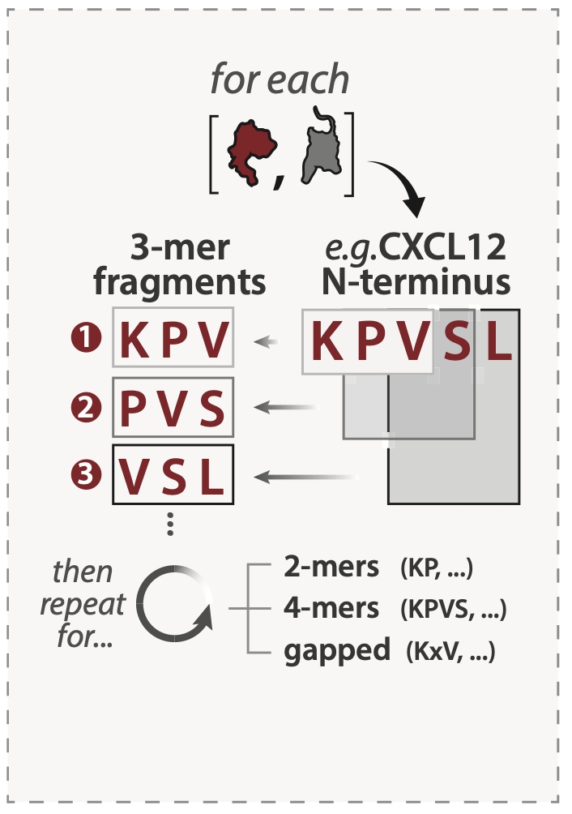

## **fragments** and **short linear motifs (SLiMs)** in the **GPCR N-terminus**

<br>

```{r, out.width='25%', fig.align='center', message=FALSE, echo=FALSE}

```

<br>

#### Short interaction interfaces in unstructured regions – referred to as **short linear motifs (SLiMs)** – are pervasive in the human proteome and anchor protein-protein interactions (PPIs) in variety of contexts. For each chemokine and receptor sequence in our alignment, we enumerated every 2-mer, 3-mer, 4-mer, and gapped peptide fragment (e.g. AxD, ADxP) observed in chemokine N-termini, receptor N-termini, and receptor ECL2. Resulting sequence fragments were then scored for their representation among other human chemokine paralogs (paralog conservation) and among orthologs of the same protein across species (ortholog conservation), agnostic of fragment positioning the queried region. We define **putative SLiMs** as peptide fragments with *ortholog conservation ≥ 0.5*. We use the term **fragments** to refer to *any 2-4 residue stretch regardless of conservation*.

<br>


```{r, echo=FALSE, message=FALSE, warning=FALSE}
source("code/000_libraries.R")
data <- read_csv("data/motif/processed/CKR_MOTIF_FREQUENCY_NTERM.csv") %>%
  mutate(protein = toupper(protein)) %>%
  mutate(mer = case_when(
    mer == "mer2" ~ "2-mer",
    mer == "mer3" ~ "3-mer",
    mer == "mer4" ~ "4-mer"
  )) %>% dplyr::select(-count_family, -total_family, -pct_family, -class) %>%
  mutate(pct_ortho = round(pct_ortho, 2)) %>%
  mutate(pct_super = round(pct_super, 2))
colnames(data) <- c("fragment", "protein", "length", "mask", 
                    "ortholog count", "total no. orthologs","ortholog conservation",
                    "family count", "total no. family","paralog conservation")


```


```{r, echo=FALSE, message=FALSE, warning=FALSE}

reactable(data, filterable = TRUE, defaultPageSize = 20)

```

#### The table includes the following columns:  

- *"fragment"* - amino acid sequence found in the N-terminus of at least 1 chemokine receptor
- *"protein"* - protein in which sequence fragment is found
- *"length"* - length of sequence fragment (e.g. "2-mer" refers to a fragment that spans 2 amino acids)
- *"ortholog count"* - number of 1:1 orthologs in which this fragment is found
- *"total no. of orthologs"* - total number of 1:1 orthologs for which sequences were  available for the given protein
- *"ortholog conservation"* - fraction of 1:1 orthologs possessing the fragment among those queried. Fragments with "ortholog conservation" ≥ 0.5 are considered "putative SLiMs"
- *"paralog count"* - number of paralogs (i.e. human chemokine receptors) in which this fragment is found
- *"total no. of paralogs"* - total number of human paralogs
- *"paralog conservation"* - fraction of human paralogs possessing the fragment among those queried