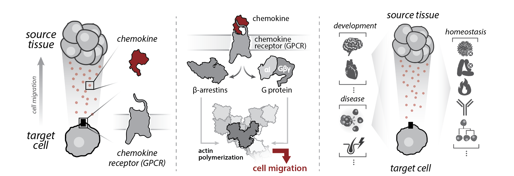

## **chemokine selectivity** atlas

```{r, out.width='90%', fig.align='center', echo=FALSE}

```

#### **Overview**
In humans, selective interactions among 46 secreted **chemokines** and 23 cell-surface **G protein-coupled receptors (GPCRs)** coordinate **cell migration** in essential physiologic processes. Chemokines and GPCRs encode highly complex coupling networks despite conserved structural architectures among respective binding partners. *This web resource is intended to facilitate structure-function studies of chemokines and GPCRs and protein design efforts.*

<br>

#### **This website features:**
- Literature-curated chemokine-GPCR **interaction network**
- **Generic numbering** systems for chemokines and GPCRs
- **Short linear motifs (SLiMs**) for chemokine N-termini, GPCR N-termini, & GPCR ECL2
- Naturally occurring, cancer-associated, and phenotype-associated **variants** for chemokines and GPCRs
- Chemokine and GPCR **sequence alignments**

<br>

##### **Contact us**
Please email andrew.b.kleist@gmail.com (Andrew Kleist), bvolkman@mcw.edu (Brian Volkman), or madan.babu@stjude.org (Madan Babu)

##### **Citation**
This manuscript is being prepared for submission, we will update this section following publication
