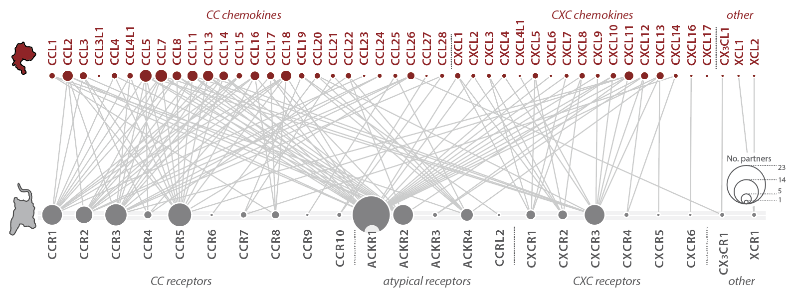

## chemokine-GPCR **interaction network** viewer

<br>

```{r, out.width='75%', fig.align='center', echo=FALSE}

```

#### The above chemokine-GPCR network representation depicts **positive chemokine-GPCR interaction pairings** from literature review. Positive pairings are defined in this instance as chemokine-GPCR interactions with Interaction Strength ≥ 2 (i.e. binding or functional data from at least one source demonstrating a quantatative parameter such as Kd or EC50 that is ≤ 1000nM). An interactive version of this network is presented below. Node size scaling may vary compared to the figure above.

<br>

```{r, echo=FALSE, message=FALSE, warning=FALSE}
source("code/000_libraries.R")
data <- read.csv("data/network/Supplementary_Table_1.csv") %>%
  dplyr::select(chemokine, gpcr, author_date_journal, PMID, binding_kd_ki_nm, binding_ec50_ic50_nm, signaling_ec50_ic50_nm, chemotaxis_ec50_ic50_nm, chemotaxis_max_nm, ligand_type, interaction_strength, evidence_grade)
```


```{r, echo=FALSE, message=FALSE, warning=FALSE, results='asis'}
# select positive pairings
# only selects positive interactions, defined as at least one piece of evidence with interaction strength ≥ 2
links <- data %>% 
  dplyr::select(chemokine, gpcr, interaction_strength) %>%
  filter(interaction_strength %in% c(2,3)) %>%
  dplyr::select(chemokine, gpcr, interaction_strength) %>% unique()

# make node table
a <- data %>% select(chemokine, interaction_strength) %>%
    filter(interaction_strength %in% c(2,3)) %>%
  dplyr::select(-interaction_strength) %>%
  dplyr::count(chemokine)
a$group <- c("chemokine")
colnames(a) <- c("name", "size","group")
b <- data %>% select(gpcr, interaction_strength) %>%
    filter(interaction_strength %in% c(2,3)) %>%
  dplyr::select(-interaction_strength) %>%
  dplyr::count(gpcr)
b$group <- c("gpcr")
colnames(b) <- c("name", "size","group")
nodes <- rbind(a,b)
rm(a,b)
nodes$index <- c(0:(nrow(nodes)-1))

# sub chemokine/gpcr names for index values
links$source <- nodes$index[match(unlist(links$chemokine), nodes$name)]
links$target <- nodes$index[match(unlist(links$gpcr), nodes$name)]

# graph
colors <- paste(sapply(nodes$colors, function(x) { paste0("d3.rgb(", paste(c(col2rgb(x), 0.5), collapse = "," ), ")") }), collapse = ", ")
colorJS <- paste0('d3.scaleOrdinal().range(["#C0392B", "#424949"])')

p <- forceNetwork(Links = links, Nodes = nodes,
            Source = "source", Target = "target",
            Value = "interaction_strength", NodeID = "name", 
            Nodesize = "size",
            colourScale = colorJS,
            Group = "group", opacity = 0.8, zoom = TRUE, fontSize = 12,
            legend = TRUE, opacityNoHover = TRUE,bounded = TRUE
            )

# p <- simpleNetwork(pos.ck.gpcr, Source = "chemokine", Target = "gpcr", 
#                    zoom = TRUE,  fontSize = 12, nodeColour = c(200,800))
p
```

